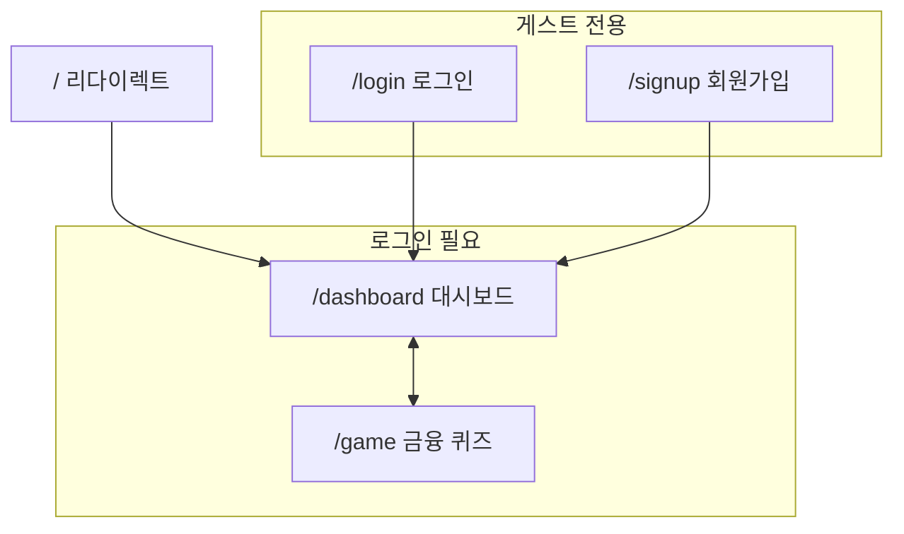
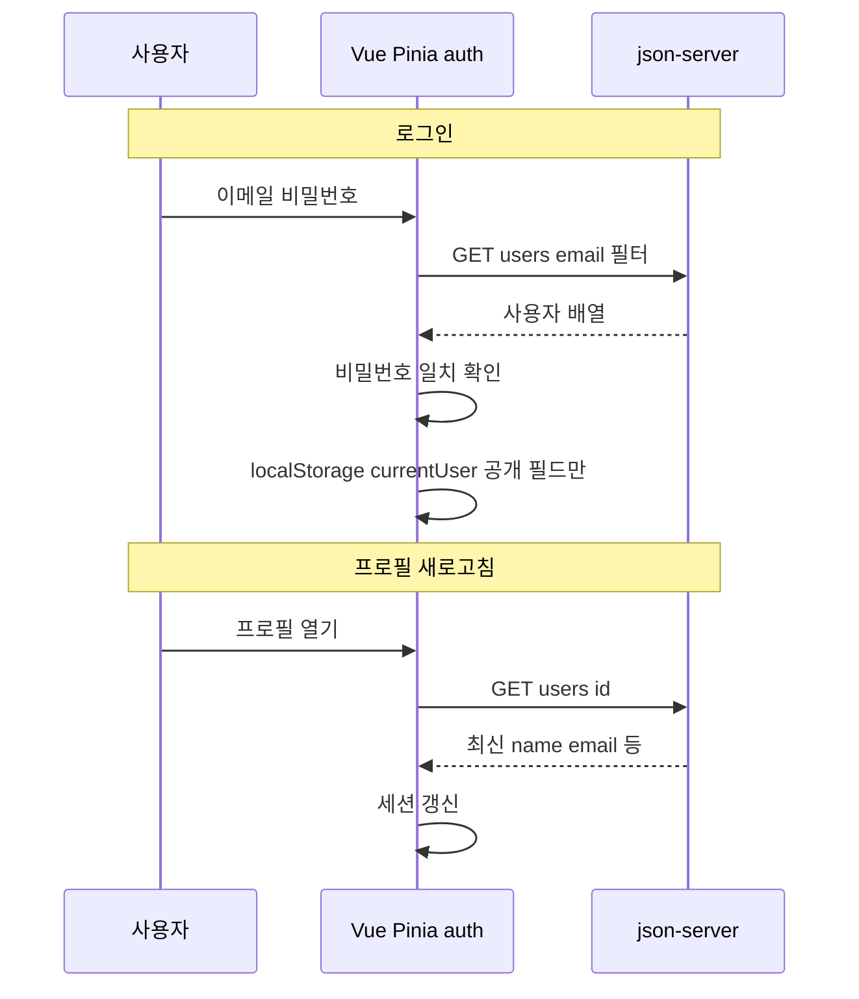
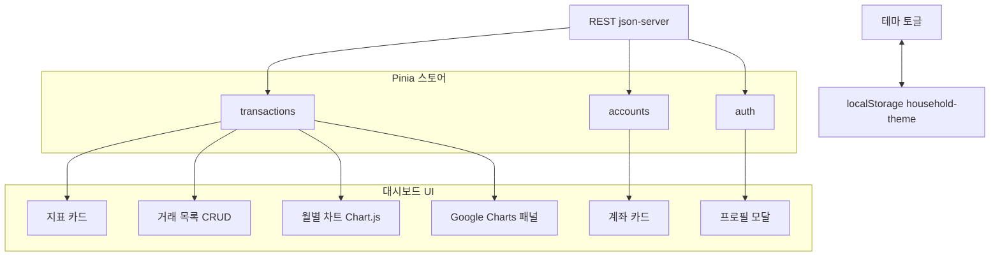
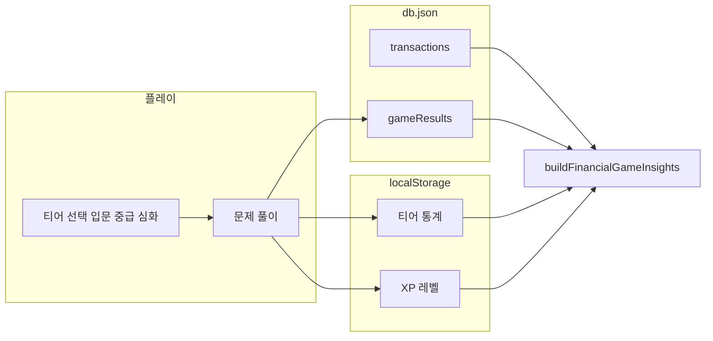
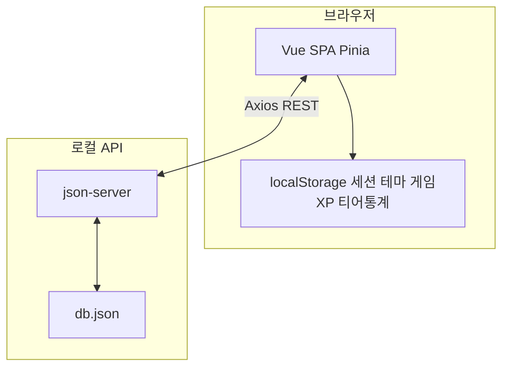

# Vue 3 가계부 앱 (kb-cursor)

- 원본 React/TypeScript 가계부 UI를 **Vue 3/JavaScript(ECMA6)** 기반으로 옮긴 웹 애플리케이션입니다.
- `거래를 기록·조회하고, 요약 지표·차트로 흐름`을 보여 주며, `금융 리터러시 퀴즈(게임)`로 학습 요소를 더했습니다. 
- 백엔드 대신 **json-server**와 `db.json`으로 REST API를 흉내 내어 로컬에서 바로 동작하게 구성되어 있습니다.
<br>
<hr>


---

## 목차

- [기능 개요](#기능-개요)
- [기술 스택](#기술-스택)
- [아키텍처 요약](#아키텍처-요약)
- [시작하기](#시작하기)
- [환경 변수](#환경-변수)
- [프로젝트 구조](#프로젝트-구조)
- [모듈·함수 레퍼런스](#모듈함수-레퍼런스)
- [데이터 모델 (db.json)](#데이터-모델-dbjson)
- [라우팅·인증](#라우팅인증)
- [빌드·배포](#빌드배포)
- [알려진 제한](#알려진-제한)

---

## 기능 개요

아래 그림은 **화면 흐름**, **인증**, **대시보드 구성**, **게임·데이터** 관계를 한눈에 보기 위한 것입니다. GitHub·대부분의 마크다운 뷰어에서 Mermaid로 렌더링됩니다.

### 화면·라우팅 흐름

게스트는 로그인·회원가입만 이용하고, 인증 후에는 대시보드와 금융 게임을 오갈 수 있습니다.



### 인증·프로필

- **회원가입 / 로그인**: 이메일·비밀번호 기준. 가입 시 `users`에 저장되고, 로그인 성공 시 **공개 사용자 정보**(id, name, email, avatarUrl)만 `localStorage`에 유지합니다.
- **세션 복원**: 새로고침 후에도 로그인 상태를 유지합니다.
- **프로필**: 서버(`GET /users/:id`)에서 최신 이름·이메일을 다시 불러와 세션과 동기화할 수 있습니다.

로그인 시 API에서 사용자를 찾고, 브라우저에는 민감 정보를 최소화한 세션만 둡니다.



### 대시보드

- **지표 카드**: 총 수입, 총 지출, 잔액(수입 − 지출), 흑자/적자 표시.
- **거래 목록**: 날짜 기준 정렬, **페이지네이션**, 항목 **추가·수정·삭제**.
- **계좌 카드**: 사용자별 계좌 목록 연동(스토어·API).
- **차트**
  - **월별 수입/지출**: Chart.js(`vue-chartjs`) 기반.
  - **Google Charts 패널**: 별도 컴포넌트로 확장 가능한 시각화 영역.
- **테마**: 라이트/다크 전환, `data-bs-theme` 및 `localStorage`에 저장.

한 화면에서 지표·거래·계좌·두 종류의 차트가 **같은 Pinia 스토어·API 데이터**를 바탕으로 갱신됩니다. 테마만 `localStorage`와 직결됩니다.



### 금융 게임 (`/game`)

- **난이도 티어**(입문·중급·심화)별 객관식 문제로 가계부·소비 습관 개념을 학습합니다.
- **XP·레벨**: 정답 시 경험치 누적, 일정 XP마다 레벨 상승(로직은 Pinia `game` 스토어).
- **티어별 통계**: 시도·정답·라운드 등을 `localStorage`에 사용자별로 저장합니다.
- **맞춤 인사이트**: `financialGameInsights` 유틸이 거래 내역·게임 기록·티어 통계·XP를 묶어 개선 제안 문구를 생성합니다.
- 게임 **결과/이력**은 API(`gameResults` 등)와 연동되는 스토어가 있습니다.

퀴즈 진행 → XP는 브라우저에, 라운드 요약은 서버에 쌓이고, 거래·이력과 합쳐 인사이트 문구가 만들어집니다.



### 기타

- `scripts/generate-db.mjs`: 시드/DB 생성 보조 스크립트.
- Axios **공통 클라이언트**: 개발·프로덕션별 `baseURL` 규칙이 주석과 코드에 정리되어 있습니다.

기능 전반에서 **서버에 남는 데이터**와 **브라우저에만 두는 데이터**를 구분하면 이해가 쉽습니다.



---

## 기술 스택

| 구분 | 사용 |
|------|------|
| UI 프레임워크 | Vue 3 (Composition API, `<script setup>`) |
| 빌드 | Vite 7 |
| 상태 관리 | Pinia |
| 라우팅 | Vue Router 4 |
| 스타일 | Tailwind CSS 4, PostCSS, **Bootstrap 5**, Bootstrap Icons |
| HTTP | Axios |
| 차트 | Chart.js, vue-chartjs |
| 로컬 API | json-server (`db.json`) |
| 병렬 실행 | concurrently (`dev:full`) |

---

## 아키텍처 요약

```text
브라우저 (Vue SPA)
    │  Axios (REST)
    ▼
json-server ← db.json  (users, transactions, accounts, gameResults 등)
```

- **영구 저장(서버)**: `db.json`에 반영되는 리소스는 json-server를 통해 CRUD.
- **클라이언트 전용**: 로그인 세션(`currentUser`), 다크 모드, 게임 XP/통계 등은 **`localStorage`**에 저장.

개발 시 API 기본 주소는 `src/api/client.js`에서 `VITE_API_BASE_URL` 또는 개발용 기본 호스트(`window.location.hostname` + 포트)로 결정됩니다. `package.json`의 `npm run api`는 **3001** 포트를 사용하므로, 기본 개발 URL과 맞지 않으면 [환경 변수](#환경-변수)로 맞춰 주세요.

프로덕션에서는 보통 **`/api`** 로 요청하고, Nginx 등에서 실제 백엔드로 프록시하는 방식을 가정합니다(Vite `preview`에도 `/api` 프록시 설정이 있습니다).

---

## 시작하기

### 요구 사항

- Node.js(프로젝트에 맞는 LTS 권장)
- npm 또는 yarn

### 설치

```bash
npm install
```

### 프론트만 실행 (API 없이 UI만 보려는 경우)

```bash
npm run dev
```

API가 없으면 로그인·목록 요청이 실패할 수 있습니다.

### API + 프론트 동시 실행 (권장)

```bash
npm run dev:full
```

- Vite 개발 서버와 json-server가 함께 뜹니다.
- json-server는 `db.json`을 감시하며 **포트 3001**에서 동작합니다(`package.json`의 `api` 스크립트).

API 주소가 어긋나면 프로젝트 루트에 `.env.development`를 두고 아래를 설정하세요.

### 기타 스크립트

```bash
npm run api          # json-server만 (포트 3001)
npm run build        # 프로덕션 빌드 → dist/
npm run preview      # 빌드 결과 미리보기
```

---

## 환경 변수

| 변수 | 설명 |
|------|------|
| `VITE_API_BASE_URL` | API 베이스 URL. 미설정 시 개발에서는 코드에 정의된 기본값, 프로덕션에서는 `/api`를 사용합니다. json-server를 **3001**에 둔 경우 예: `http://127.0.0.1:3001` |

`.env`, `.env.development` 등은 저장소에 올리지 마세요(`.gitignore`에 포함).

---

## 프로젝트 구조

```text
vueapp/
├── public/                 # 정적 자산
├── scripts/                # DB 생성 등 보조 스크립트
├── src/
│   ├── api/client.js       # Axios 인스턴스, baseURL 규칙
│   ├── components/         # 카드, 모달, 차트, 목록 등 UI 조각
│   ├── composables/        # 예: Google Charts 로더
│   ├── router/index.js     # 라우트·네비게션 가드
│   ├── stores/             # Pinia: auth, transactions, accounts, theme, game, gameResults …
│   ├── utils/              # 예: financialGameInsights
│   ├── views/              # Login, Signup, Dashboard, Game
│   ├── App.vue
│   ├── main.js
│   └── style.css
├── db.json                 # json-server 데이터 시드
├── vite.config.js          # 별칭 @ → src, /api 프록시(프리뷰·개발)
├── package.json
└── README.md
```

---

## 모듈·함수 레퍼런스

아래는 **외부에서 호출하거나 템플릿·다른 모듈에서 참조하는 식별자** 위주입니다. Pinia 스토어는 `use*Store()`로 얻은 객체의 **반환 프로퍼티**를 적었고, 파일 내부 전용 헬퍼(`toPublicUser`, `monthKey` 등)는 생략하거나 한 줄로만 표시합니다.

### `src/main.js`

| 식별자 | 설명 |
|--------|------|
| (부트스트랩) | `createApp(App)` → `use(createPinia())` → `use(router)` → `mount('#app')`. 전역 CSS(`style.css`), Bootstrap 번들 JS 로드. |

### `src/App.vue`

| 식별자 | 설명 |
|--------|------|
| (setup) | `useThemeStore()`, `useGameStore()`를 호출해 테마 적용·게임 스토어 사용자 전환 감시가 앱 전역에서 동작하도록 함. |
| `<router-view />` | 라우트별 페이지 컴포넌트 마운트 지점. |

### `src/api/client.js`

| 식별자 | 설명 |
|--------|------|
| `devDefaultBase()` | 개발 모드 기본 API 호스트. `window` 없으면 `127.0.0.1:3000`, 있으면 `http://{hostname}:3000`. |
| `api` | `axios.create({ baseURL, headers })` 인스턴스. `baseURL`은 `VITE_API_BASE_URL` → (개발) `devDefaultBase()` → (프로덕션) `/api` 순으로 결정. |

### `src/router/index.js`

| 식별자 | 설명 |
|--------|------|
| `router` (default export) | `createWebHistory`, 라우트: `/`→`/dashboard`, `/login`, `/signup`, `/dashboard`, `/game`. |
| `router.beforeEach` | `authStore.restoreSession()` 후 `requiresAuth`·`guestOnly` 메타에 따라 리다이렉트. |

### `src/composables/loadGoogleCharts.js`

| 함수 | 설명 |
|------|------|
| `loadGoogleCharts()` | `window` 없으면 `Promise.resolve()`. 이미 로더 있으면 `charts.load`·`setOnLoadCallback`만 실행. 없으면 `gstatic` 스크립트 삽입 후 동일. **중복 로드 방지**를 위해 모듈 스코프 `loadPromise` 캐시. 실패 시 `reject`. |

### `src/utils/financialGameInsights.js`

| 함수 | 설명 |
|------|------|
| `buildFinancialGameInsights({ transactions, gameHistory, tierStats, xp, level })` | **유일한 export.** 거래 합계·카테고리·흑자/적자·티어별 정답률·최근 라운드 정답률 등을 바탕으로 **휴리스틱 문구** 생성. 반환: `{ summary: string, items: string[] }` (중복 제거 후 최대 6문장). |

내부: `tierAccuracy(tierStats, t)` — 티어 `t` 정답률(%) 또는 시도 없으면 `null`.

### `src/stores/auth.js` — `useAuthStore()`

| 종류 | 이름 | 설명 |
|------|------|------|
| state | `user` | 현재 사용자(`null` 또는 `{ id, name, email, avatarUrl }`). |
| state | `profileLoading`, `profileError` | 프로필 API 로딩·에러 메시지. |
| computed | `isAuthenticated` | `!!user`. |
| method | `restoreSession()` | 메모리에 `user` 없을 때만 `localStorage`의 `currentUser` 복원. |
| method | `fetchProfile()` | `GET /users/:id` 후 세션 갱신. `{ ok, message? }`. |
| method | `signup(name, email, password)` | 이메일 중복 조회 후 `POST /users`, 성공 시 세션 저장. `{ ok, message? }`. |
| method | `login(email, password)` | `GET /users?email=` 후 클라이언트에서 비밀번호 일치 확인. `{ ok, message? }`. |
| method | `logout()` | `user` 초기화 및 `localStorage` 세션 키 제거. |

내부: `toPublicUser`, `persistSession` — 스토어 내부에서만 사용.

### `src/stores/transactions.js` — `useTransactionStore()`

| 종류 | 이름 | 설명 |
|------|------|------|
| state | `transactions`, `loading`, `error` | 거래 배열·로딩·에러 문자열. |
| state | `listPage`, `listPageSize` | 목록 페이지(기본 8건/페이지). |
| computed | `sortedTransactions` | 날짜 내림차순 정렬 복사본. |
| computed | `listTotalPages`, `pagedSortedTransactions`, `listRangeText` | 페이지네이션 UI용. |
| computed | `totalIncome`, `totalExpense`, `balance` | 전체 수입·지출·차이. |
| computed | `chartData` | 월별 `{ month, income, expense }` 배열(최근 4개월). |
| method | `goToListPage(p)` | 페이지 클램프 후 이동. |
| method | `fetchTransactions()` | `GET /transactions?userId=`. `{ ok, message? }`. |
| method | `addTransaction(payload)` | `POST /transactions` (`date`, `category`, `description`, `amount`, `type`). |
| method | `updateTransaction(id, payload)` | `PUT /transactions/:id`. |
| method | `deleteTransaction(id)` | `DELETE /transactions/:id`, 목록에서 제거 후 페이지 보정. |

내부: `monthKey`, `monthLabel`, `clampListPage`, `setErrorFromResponse`.

### `src/stores/accounts.js` — `useAccountStore()`

| 종류 | 이름 | 설명 |
|------|------|------|
| state | `accounts`, `loading`, `error`, `page`, `pageSize` | 계좌 목록·페이지(기본 5건). |
| computed | `totalPages`, `pagedAccounts`, `rangeText` | 페이지네이션. |
| method | `fetchAccounts()` | `GET /accounts?userId=`. |
| method | `goToPage(p)` | 페이지 이동(범위 클램프). |
| method | `clear()` | 목록·페이지·에러 초기화(로그아웃 등). |

### `src/stores/theme.js` — `useThemeStore()`

| 종류 | 이름 | 설명 |
|------|------|------|
| state | `dark` | 다크 모드 여부(`localStorage` `household-theme`과 동기화). |
| method | `toggle()` | 다크 토글. |
| (내부) | `apply(dark)` | `data-bs-theme`, `app-dark` 클래스 반영. `watch`에서 즉시·이후 변경 시 호출. |

### `src/stores/game.js` — `useGameStore()`

| 종류 | 이름 | 설명 |
|------|------|------|
| state | `xp`, `tierStats` | XP·티어별 `{ correct, attempted, rounds }`(키 `1`~`3`). `localStorage` 키는 사용자 id별. |
| computed | `level` | `floor(xp/100)+1`. |
| computed | `xpInCurrentLevel` | 현재 레벨 구간 XP(`xp % 100`). |
| computed | `totalsFromStats` | 전 티어 합산 `correct`, `attempted`, `rounds`, `accuracy`(%) 또는 `null`. |
| method | `addXp(amount)` | XP 가산 후 `persist()`. |
| method | `recordRound({ tier, correct, total })` | 해당 티어 통계 누적 후 `persistStats()`. |
| method | `loadForUser(userId)` | 사용자 변경 시 XP·통계 로드 또는 초기화. (`watch`에서 자동 호출) |
| (내부) | `mergeTierStats`, `persist`, `persistStats` | 저장/파싱 보조. |

### `src/stores/gameResults.js` — `useGameResultsStore()`

| 종류 | 이름 | 설명 |
|------|------|------|
| state | `history`, `loading`, `error` | 서버에서 가져온 게임 라운드 기록(최신순). |
| method | `fetchMyResults()` | `GET /gameResults?userId=`, `createdAt` 기준 정렬. |
| method | `saveResult(payload)` | `POST /gameResults` (`tier`, `correct`, `total`, `xpTotal`, `level`, `createdAt` 자동). 본문 값은 클램프·기본값 처리. |

### `src/views/` (페이지)

| 파일 | 주요 동작 |
|------|-----------|
| `LoginView.vue` | `authStore.login`, 유효성·에러 표시, 성공 시 라우터 이동. |
| `SignupView.vue` | `authStore.signup`, 중복 이메일 메시지 처리. |
| `DashboardView.vue` | `loadDashboard`(프로필·거래·계좌 병렬 로드), 로그아웃 시 관련 스토어 초기화, 거래 CRUD 모달 연동, 테마 토글, `MonthlyChart`·`GoogleChartsPanel`에 데이터 전달. |
| `GameView.vue` | 티어별 `QUESTION_TIERS` 퀴즈 진행, `gameStore.addXp`·`recordRound`, `gameResultsStore.saveResult`·`fetchMyResults`, `buildFinancialGameInsights`로 `improvementPlan` 표시. |

### `src/components/` (UI 조각)

컴포넌트는 **export 함수**가 없고, 아래는 **props / emit** 및 역할입니다.

| 파일 | props | emit / 역할 |
|------|-------|-------------|
| `MetricCard.vue` | `label`, `value`, `change?`, `changeType?` | 지표 한 칸 표시. |
| `MonthlyChart.vue` | `data` (`{ month, income, expense }[]`) | Chart.js 막대 그래프. |
| `GoogleChartsPanel.vue` | `transactions`, `dark?` | `loadGoogleCharts()` 후 월별 집계·Google 시각화(내부 `monthKey`/`monthLabel` 등). |
| `TransactionList.vue` | `transactions` | `edit`(행 객체), `delete`(id). 카테고리별 배지·이모지 매핑. |
| `AddTransactionModal.vue` | `modelValue`, `editing?` | `update:modelValue`, 신규 시 `submit`(payload), 수정 시 `update`({ id, … }). |
| `ProfileModal.vue` | `modelValue` | `update:modelValue`. 아바타·요약·`auth`/`transactions`/`game` 스토어 표시. |
| `AccountListCard.vue` | (없음) | `useAccountStore()` 직접 사용, 계좌 테이블·페이지 버튼. |

### `scripts/generate-db.mjs`

| 동작 | 설명 |
|------|------|
| (스크립트 최상위) | 하드코딩된 거래·계좌·게임 결과·데모 유저로 `db` 객체 구성 후 프로젝트 루트 `db.json`에 `writeFileSync`. **export 없음** — `node scripts/generate-db.mjs` 형태로 실행. |

### `vite.config.js`

| 식별자 | 설명 |
|--------|------|
| `default export` | `@` → `./src` 별칭, `server`/`preview`의 `/api` → `127.0.0.1:3000` 프록시(경로에서 `/api` 제거). |

---

## 데이터 모델 (db.json)

- **`users`**: id, name, email, password, avatarUrl 등. 데모용 평문 비밀번호이므로 **실서비스에 그대로 쓰면 안 됩니다.**
- **`transactions`**: userId, date, category, description, amount, type(`income` | `expense`).
- **계좌·게임 결과** 등 다른 컬렉션은 스토어·API 사용처에 맞게 확장되어 있습니다.

기본 데모 계정 예시는 `db.json`의 `users`를 참고하세요(예: `demo@example.com`).

---

## 라우팅·인증

| 경로 | 설명 |
|------|------|
| `/` | `/dashboard`로 리다이렉트 |
| `/login`, `/signup` | 비로그인 전용(`guestOnly`). 이미 로그인 시 대시보드로 보냄 |
| `/dashboard`, `/game` | 로그인 필요(`requiresAuth`) |

`router.beforeEach`에서 `authStore.restoreSession()` 후 위 규칙을 적용합니다.

---

## 빌드·배포

```bash
npm run build
```

산출물은 `dist/`입니다. 정적 호스팅 시 **API는 별도 서버** 또는 **경로 프록시**로 제공해야 하며, 클라이언트의 `VITE_API_BASE_URL` 또는 `/api` 프록시 설정과 일치시켜야 합니다.

---

## 알려진 제한

- **json-server + 평문 비밀번호**는 개발·데모용입니다. 실제 서비스에는 해시·HTTPS·토큰 기반 인증 등이 필요합니다.
- 로그인 시 이메일로 사용자를 조회한 뒤 클라이언트에서 비밀번호를 비교하는 방식은 **교육/로컬 목적**에 가깝습니다.
- 브라우저·포트·프록시 조합에 따라 API URL을 환경 변수로 조정해야 할 수 있습니다.

---

## 라이선스·기여

개인/팀 프로젝트에 맞게 `package.json`의 `license` 필드와 저장소 정책을 설정하세요.

<hr>
아래는 요청한 내용을 **한글로 체계적으로 정리한 문서**입니다. (개념 + 구조 + 흐름 중심으로 설명)

---

# 📘 JSON Server와 db.json 

## 1️⃣ JSON Server 설정 방법

JSON Server는 **가짜 REST API 서버를 빠르게 만들어주는 도구**입니다.
프론트(Vue 등) 개발 시 백엔드 없이도 API 테스트가 가능합니다.

### 🔧 설치

```bash
npm install -g json-server
```

### 📄 db.json 파일 생성

프로젝트 루트에 `db.json` 파일을 생성합니다.

### ▶️ 서버 실행

```bash
json-server --watch db.json
```

* 기본 주소: `http://localhost:3000`
* 자동으로 REST API 생성됨

---

## 2️⃣ db.json 구조

### 📌 예시

```json
{
  "posts": [
    { "id": 1, "title": "Post 1", "author": "Author 1" },
    { "id": 2, "title": "Post 2", "author": "Author 2" }
  ],
  "comments": [
    { "id": 1, "body": "Comment 1", "postId": 1 },
    { "id": 2, "body": "Comment 2", "postId": 1 }
  ]
}
```

### 💡 구조 설명

* `posts`, `comments` → 각각 하나의 **리소스(Resource)**
* `id` → 기본 키 (Primary Key)
* `postId` → 관계 설정 (외래 키 느낌)

👉 즉, 하나의 JSON 파일로 **DB처럼 사용 가능**

---

## 3️⃣ 자동 생성되는 API

`db.json`을 기반으로 자동으로 REST API가 만들어집니다.

### 📡 예시

| 기능    | 요청 방식       | URL        |
| ----- | ----------- | ---------- |
| 전체 조회 | GET         | `/posts`   |
| 단일 조회 | GET         | `/posts/1` |
| 생성    | POST        | `/posts`   |
| 수정    | PUT / PATCH | `/posts/1` |
| 삭제    | DELETE      | `/posts/1` |

---

## 4️⃣ Vue 앱과 JSON Server 관계

Vue 앱은 JSON Server를 **백엔드처럼 사용**합니다.

### 📊 구조 흐름

```
Vue (Frontend)
   ↓ axios / fetch
HTTP 요청 (GET, POST 등)
   ↓
JSON Server (db.json)
   ↓
데이터 반환 (JSON)
```

---

## 5️⃣ Vue에서 사용하는 방식

### 📌 axios 예시

```javascript
import axios from 'axios';

// 전체 데이터 조회
const getPosts = async () => {
  const res = await axios.get('http://localhost:3000/posts');
  console.log(res.data);
};

// 데이터 추가
const addPost = async () => {
  await axios.post('http://localhost:3000/posts', {
    title: '새 글',
    author: '작성자'
  });
};
```

---

## 6️⃣ 핵심 개념 정리

* JSON Server = **가짜 백엔드 서버**
* db.json = **데이터베이스 역할**
* Vue = **프론트엔드**
* Axios = **통신 도구**

👉 이 구조로 **프론트 + 백엔드 분리 개발 가능**

---

## 7️⃣ 장점과 한계

### ✅ 장점

* 빠른 개발 (백엔드 없이 가능)
* REST API 자동 생성
* 테스트 및 학습에 최적

### ❌ 한계

* 실제 DB 아님
* 인증/보안 없음
* 복잡한 로직 처리 불가

---

# 📊 최종 정리 표

| 구분           | 설명                     | 역할     |
| ------------ | ---------------------- | ------ |
| JSON Server  | 가짜 API 서버              | 백엔드 역할 |
| db.json      | JSON 데이터 파일            | DB 역할  |
| Vue App      | 사용자 UI                 | 프론트엔드  |
| Axios        | HTTP 요청 라이브러리          | 통신     |
| API Endpoint | `/posts`, `/comments`  | 데이터 접근 |
| HTTP Method  | GET, POST, PUT, DELETE | CRUD   |

---


